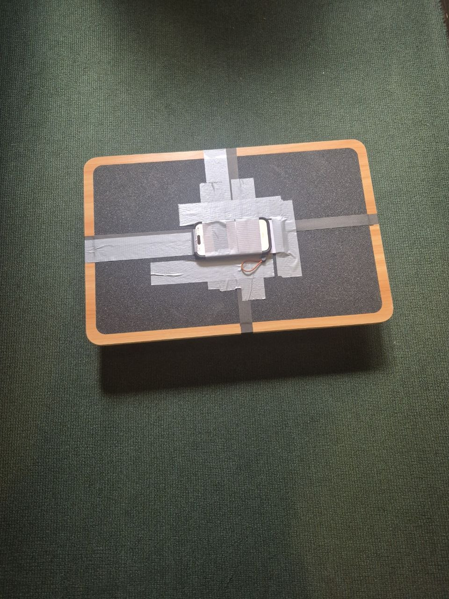
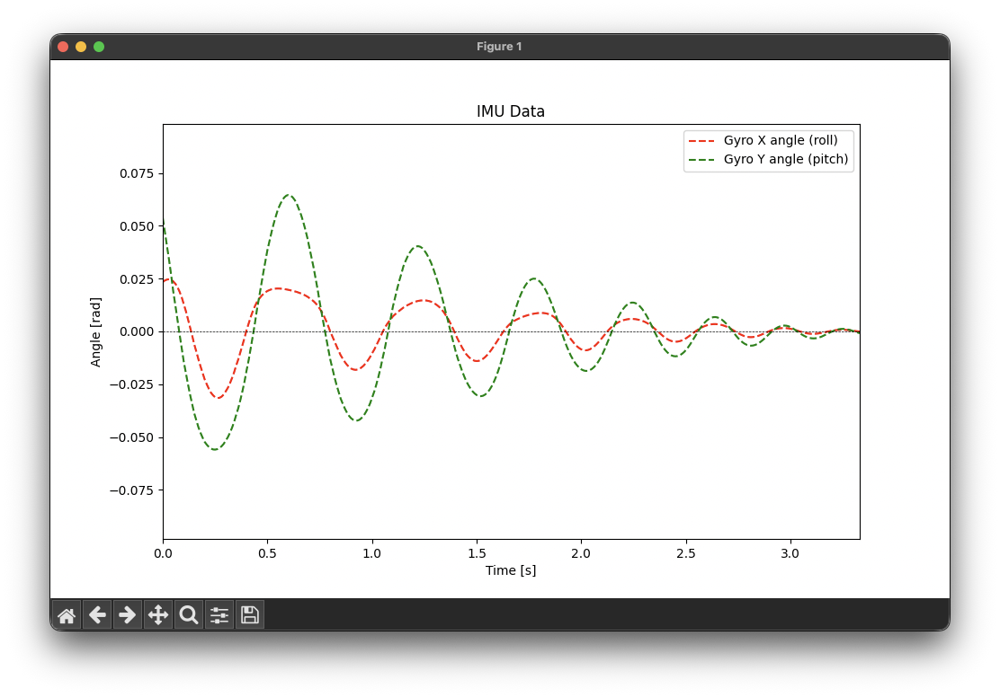

# Balance Board System Identification



This repository contains code for system identification of a balance board using IMU data recorded on a mobile device and simulation in MuJoCo. The goal is to estimate the physical parameters of the balance board by analyzing its motion during free-motion intervals.

## Requirements

Please install the required Python packages listed in `requirements.txt`:

```bash
pip install -r requirements.txt
```

## Application (App Store)

An iOS application is available on the App Store for recording IMU data from a balance board.
Similar apps exist on the Play Store for Android devices.

[Balance Board Recorder](https://apps.apple.com/us/app/sensorlogger-csv-export/id1505203547)

## Data Collection
I collected data using the Balance Board Recorder app on an iPhone securely mounted to the balance board. This data can be found in the `data` directory. Here are the steps I followed to collect data:

1. Measure the center position of the balance board.
2. Place the mobile device roughly at the center of the board, ensuring it is very securely attached while you can still access all of the buttons.
3. Wait for the board to be at rest, then start recording in the app.
4. Apply gentle perturbations to the board to induce motion, then allow it to return to rest.
5. Do this in a variety of ways to excite different modes of motion.
6. Make sure to leave a good amount of time between perturbations for the board to return to rest; give it a couple seconds after the board visibly appears to be still, because the program automatically detects rest intervals better when there is a longer duration of stillness.
7. When you are satisfied, stop recording and export the data as a CSV file.

## Usage
To analyze the recorded IMU data and perform system identification, run the `analyze.py` script with the appropriate arguments:

```bash
python analyze.py --input path/to/your/data.csv
```

You can try different dynamics models using one or more of these CLI flags:

- `--geometry-model`: Uses a geometry-based model for the balance board (see below).
- `--advanced-model`: Includes yaw and bias terms in the regression matrix.
- `--friction-model`: Includes smooth Coulomb-like friction terms based on roll and pitch rates.

If none of these flags are provided, a simple dynamics model is used by default.

The geometry model considers the fact that the base of the board is not a hemisphere, but rather two intersecting cylindrical sections. This sometimes allows for a more accurate representation of the board's dynamics by treating modes of oscillation which are combinations of pure roll and pitch more accurately.

When running, you will first get a preview of each extracted free-motion segment for sanity checking. After confirming, the program will perform system identification and output the estimated parameters along with fit quality metrics. The graphs should look something like this:



## Simulation

The `sim_mujoco.py` simulates the motion of the balance board in MuJoCo using the identified parameters, specified as CLI arguments. You can visualize the simulation and interact with it using mouse controls to apply impulses to the board.

With some trouble, I had GPT-5.1-Codex write the MuJoCo simulation file part. So I can't vouch for its correctness, but it seems to work reasonably well.